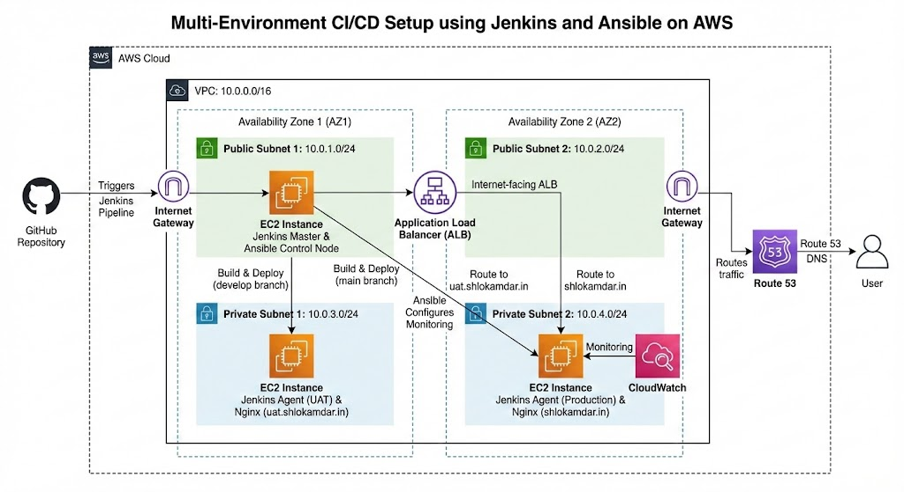

# Branch-Based CI/CD Pipeline with Jenkins on AWS

## Overview
This project implements a **production-grade CI/CD pipeline** using Jenkins that deploys a single GitHub repository to **UAT and Production environments** based on branch strategy, using **dedicated Jenkins agents**, AWS infrastructure, and automated monitoring.

## Key Features
- Branch-based deployments (`develop` → UAT, `main` → Production)
- Jenkins Multibranch Pipeline
- Dedicated EC2 agents per environment
- Automated builds and deployments
- Application Load Balancer for traffic routing
- CloudWatch monitoring (Production only)
- Infrastructure automation using Ansible

## Architecture

## Environment Strategy

| Environment | Branch | Jenkins Agent | Monitoring |
|------------|--------|--------------|------------|
| UAT | develop | uat-slave | ❌ |
| Production | main | prod-slave | ✅ |

## Tech Stack
- AWS EC2, VPC, ALB, CloudWatch
- Jenkins (Master + Agents)
- Ansible
- GitHub
- Nginx
- Node.js

## CI/CD Flow
1. Code pushed to GitHub
2. Jenkins Multibranch Pipeline detects branch
3. Build runs on environment-specific agent
4. Application deployed via Nginx
5. Production monitored via CloudWatch

## Screenshots
📸 Jenkins Dashboard  
📸 Multibranch Pipeline  
📸 Successful Production Deployment

## Lessons Learned
- Jenkins agents require Java and runtime dependencies
- Environment isolation improves deployment safety
- Monitoring should be limited to production systems

## Future Enhancements
- HTTPS with ACM
- Blue-Green deployments
- Slack notifications
- Rollback automation
