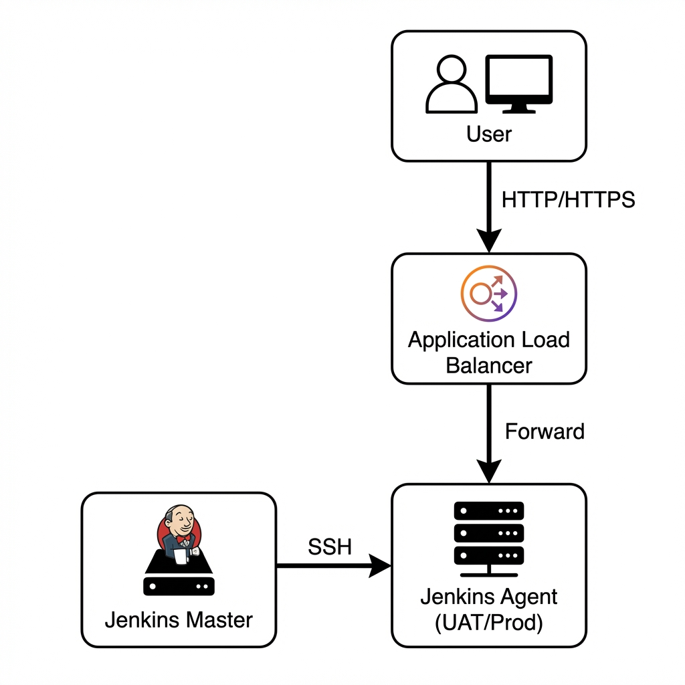

# Security Design

## Overview

This section describes the security architecture and access controls implemented across the CI/CD infrastructure.
The design follows least-privilege principles, enforces environment isolation, and ensures that no internal resources are directly exposed to the internet.

## Security Principles Applied

- **Least Privilege Access**: Only required ports and sources are allowed
- **Environment Isolation**: UAT and Production operate independently
- **No Direct Public EC2 Access**: All application traffic flows through ALB
- **Centralized Control Plane**: Jenkins master acts as the single orchestration and access point
- **Defense in Depth**: Multiple security layers across network, compute, and CI/CD

## Security Group Architecture

Each component in the system is protected by a dedicated security group with tightly scoped inbound rules.

### Jenkins Master / Bastion Security Group

**Purpose**: Allows administrative access and CI/CD orchestration while preventing unauthorized access to Jenkins and internal infrastructure.

| Rule Name | Protocol | Port | Source |
| :--- | :--- | :--- | :--- |
| SSH | TCP | 22 | Trusted IP (Admin) |
| Jenkins UI | TCP | 8080 | Trusted IP (Admin) |
| HTTP (optional) | TCP | 80 | ALB Security Group |

**Key Notes**:
- Jenkins UI is not publicly accessible
- SSH access is restricted to trusted administrator IPs
- Acts as the bastion host for agent access

### Jenkins Agent – UAT Security Group

**Purpose**: Allows Jenkins master to deploy applications while exposing the UAT application only through the load balancer.

| Rule Name | Protocol | Port | Source |
| :--- | :--- | :--- | :--- |
| SSH | TCP | 22 | Jenkins Master Security Group |
| HTTP | TCP | 80 | UAT ALB Security Group |
| HTTPS | TCP | 443 | UAT ALB Security Group |

**Key Notes**:
- No direct public SSH access
- CI/CD traffic restricted to Jenkins master
- User traffic flows only through ALB

### Jenkins Agent – Production Security Group

**Purpose**: Secures production deployments and ensures traffic is strictly controlled and monitored.

| Rule Name | Protocol | Port | Source |
| :--- | :--- | :--- | :--- |
| SSH | TCP | 22 | Jenkins Master Security Group |
| HTTP | TCP | 80 | Production ALB Security Group |
| HTTPS | TCP | 443 | Production ALB Security Group |

**Key Notes**:
- Strong isolation from UAT
- Only Jenkins master can initiate deployments
- Production traffic fully routed via ALB

### Application Load Balancer (ALB) Security Group

**Purpose**: Acts as the single public entry point for the application.

| Rule Name | Protocol | Port | Source |
| :--- | :--- | :--- | :--- |
| HTTP | TCP | 80 | 0.0.0.0/0 |
| HTTPS | TCP | 443 | 0.0.0.0/0 |

**Key Notes**:
- ALB is the only internet-facing component
- Backend EC2 instances remain private
- HTTPS termination handled via ACM

## Security Group Relationships (Traffic Flow)

This ensures clear, auditable traffic paths with no lateral or uncontrolled access.

## Bastion Host Strategy

The Jenkins Master also functions as a bastion host, providing:
- **Controlled SSH access** to internal EC2 instances
- **A single audit point** for administrative access
- **Reduced attack surface** by eliminating direct access paths

All SSH connections to Jenkins agents originate from the Jenkins Master only.