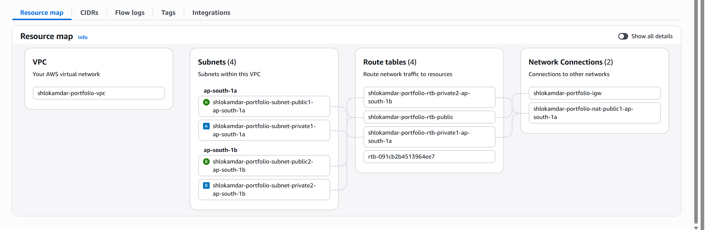
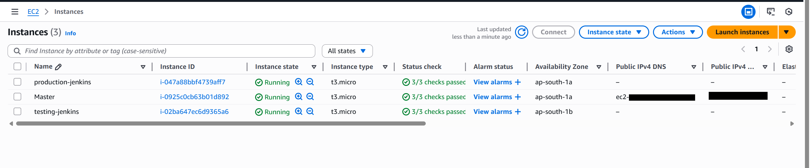
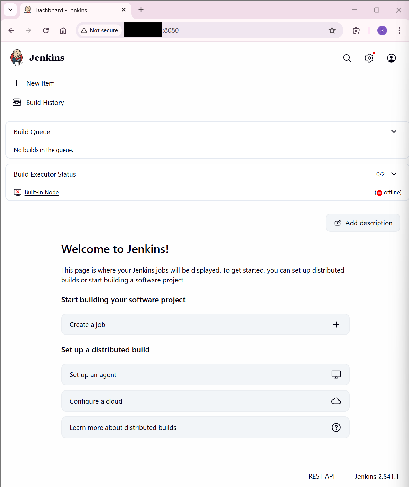
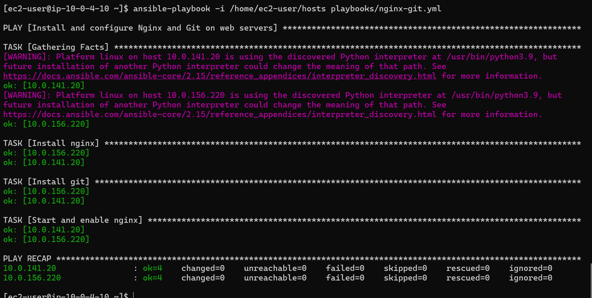
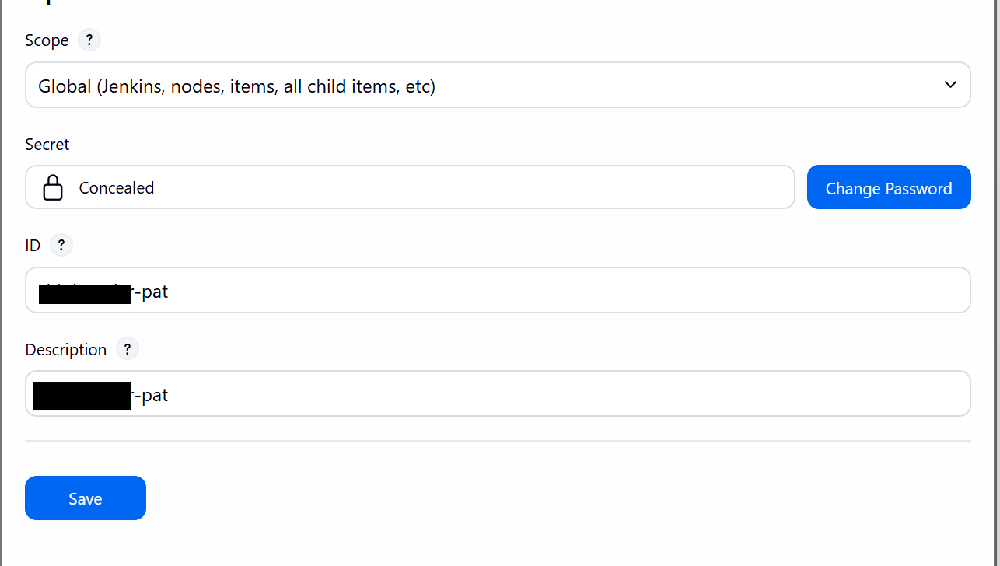
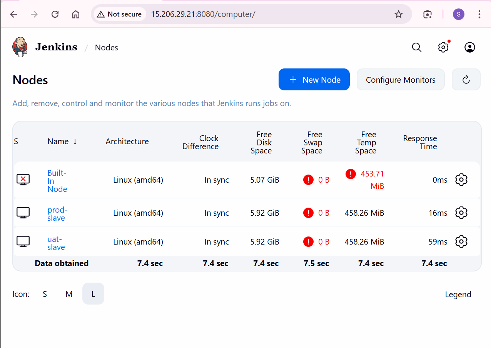
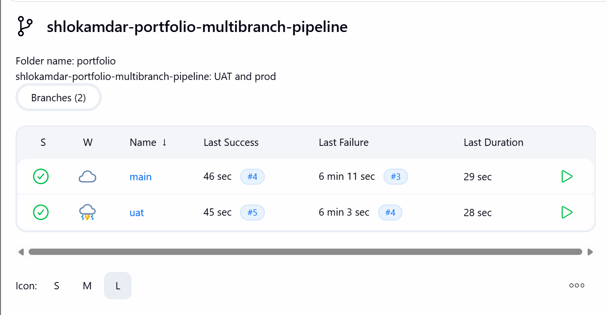
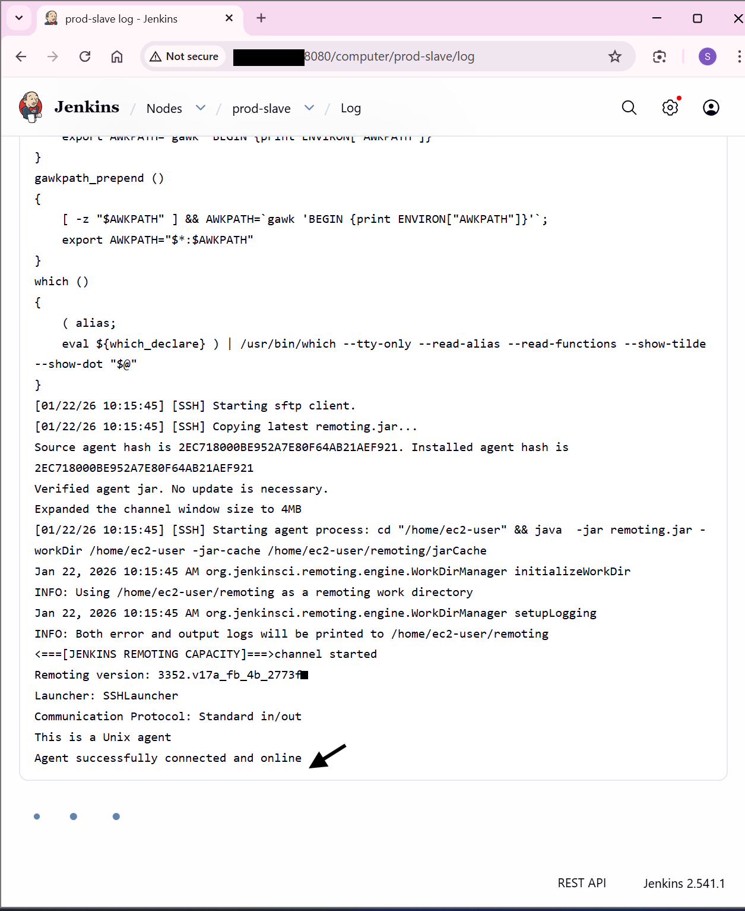

# Step-by-Step Implementation

This section documents the end-to-end design and implementation of the infrastructure and CI/CD pipeline, starting from foundational network setup to fully automated Jenkins-based deployments across UAT and Production environments.

The objective is to clearly demonstrate how each AWS and DevOps component is provisioned, configured, and interconnected, while emphasizing environment isolation, deployment safety, automation, and operational clarity. Each step builds upon the previous one to reflect a real-world, production-aligned workflow.

## 1. Setting Up the Virtual Private Cloud (VPC)

**Purpose**

To establish a secure, isolated, and scalable network foundation for hosting all CI/CD, application, and monitoring components.

**Actions Performed**

- Created a custom VPC to logically isolate project resources
- Configured public subnets to host:
    - Jenkins Master / Bastion Host
    - Jenkins Agents (UAT and Production)
    - Application Load Balancer
- Configured route tables and attached an Internet Gateway to enable controlled external access
- Applied security groups to regulate SSH, HTTP, HTTPS, and Jenkins traffic



## 2. Setting Up Compute Components (EC2 Instances)

**Purpose**

To provision dedicated compute resources for CI/CD orchestration, environment-specific application deployments, and monitoring—ensuring clear separation of responsibilities.

**Instances Launched**

- Jenkins Master / Bastion Host
- Jenkins Agent – UAT
- Jenkins Agent – Production

Each instance was assigned a specific role to avoid resource contention and ensure predictable behavior across environments.



## 3. Bastion / Jenkins Master Node

**Role**

The Jenkins Master node serves a dual purpose:
- **Jenkins Master**: responsible for pipeline orchestration, multibranch indexing, and credential management
- **Ansible Control Node**: responsible for centralized configuration management and monitoring setup

This design ensures that control logic is separated from execution logic, improving scalability and security.

### Jenkins Installation

Jenkins was installed on the master node using the official Jenkins repository.

```bash
# Add Jenkins repository
sudo wget -O /etc/yum.repos.d/jenkins.repo \
https://pkg.jenkins.io/redhat-stable/jenkins.repo
sudo rpm --import https://pkg.jenkins.io/redhat-stable/jenkins.io-2023.key

# Install dependencies
sudo dnf upgrade -y
sudo dnf install java-17-amazon-corretto -y
sudo dnf install jenkins -y

# Start Jenkins
sudo systemctl daemon-reload
sudo systemctl enable jenkins
sudo systemctl start jenkins
sudo systemctl status jenkins
```

Jenkins was verified by accessing: `http://<public-ip>:8080`



### Ansible Installation & Configuration

**Purpose**

To enable automated, repeatable configuration management for Jenkins agents, application dependencies, and monitoring components.

**Actions Performed**

- Created a dedicated ansible user
- Enabled passwordless sudo for automation
- Configured SSH access
- Installed Ansible on the master node

```bash
#!/bin/bash
set -e

# Create ansible user
useradd ansible || true
mkdir -p /home/ansible/.ssh

# Set permissions
chown -R ansible:ansible /home/ansible
chmod 700 /home/ansible/.ssh

# Enable passwordless sudo
echo "ansible ALL=(ALL) NOPASSWD: ALL" > /etc/sudoers.d/ansible
chmod 440 /etc/sudoers.d/ansible

# Enable SSH password authentication
sed -i 's/^#PasswordAuthentication.*/PasswordAuthentication yes/' /etc/ssh/sshd_config
sed -i 's/^PasswordAuthentication no/PasswordAuthentication yes/' /etc/ssh/sshd_config

# Disable root login
sed -i 's/^#PermitRootLogin.*/PermitRootLogin no/' /etc/ssh/sshd_config
sed -i 's/^PermitRootLogin yes/PermitRootLogin no/' /etc/ssh/sshd_config

systemctl restart sshd

# Install Ansible
sudo dnf install ansible -y
```

**SSH Configuration**

- Generated SSH keys on the master node
- Copied public keys to all agent nodes
- Enabled passwordless SSH access for Ansible operations

```bash
ssh-keygen
ssh-copy-id ansible@<agent-ip>
```

*Manual password setup was performed initially and can be fully automated in future iterations.*

### Ansible Playbook: Installing Prerequisites

**Purpose**

To standardize the runtime environment across all Jenkins agents and eliminate manual dependency management.

**Components Installed**

- **Java**: Required for Jenkins agent remoting
- **Nginx**: Web server for application hosting
- **Git**: Source code management

```yaml
- name: Install and configure Nginx, Git, and Java on web servers
  hosts: webservers
  become: yes

  tasks:
    - name: Install Java (required for Jenkins agent)
      yum:
        name: java-17-amazon-corretto
        state: present

    - name: Install nginx
      yum:
        name: nginx
        state: present

    - name: Install git
      yum:
        name: git
        state: present

    - name: Start and enable nginx
      service:
        name: nginx
        state: started
        enabled: yes
```



## 4. Jenkins Agent – Production Environment

**Role**

- Executes deployments triggered from the `main` branch
- Hosts the production Nginx application
- Receives traffic via the Application Load Balancer
- Integrated with CloudWatch for monitoring

This agent represents the production execution layer of the CI/CD pipeline.

## 5. Jenkins Agent – UAT Environment

**Role**

- Executes deployments triggered from the `develop` branch
- Used for validation and testing prior to production releases
- Fully isolated from production infrastructure

This separation ensures safe testing without production impact.

## 6. Security Groups Configuration

**Objective**

To enforce least-privilege network access by tightly controlling traffic between Jenkins components, application servers, and end users—while preventing unnecessary public exposure.

**Jenkins Master / Bastion Security Group**

| Protocol | Port | Source |
| :--- | :--- | :--- |
| SSH | 22 | Trusted IP |
| Jenkins UI | 8080 | Trusted IP |
| HTTP (optional) | 80 | ALB Security Group |

**Jenkins Agent Security Groups (UAT & Production)**

| Protocol | Port | Source |
| :--- | :--- | :--- |
| SSH | 22 | Jenkins Master SG |
| HTTP | 80 | ALB Security Group |
| HTTPS | 443 | ALB Security Group |

**Application Load Balancer Security Group**

| Protocol | Port | Source |
| :--- | :--- | :--- |
| HTTP | 80 | 0.0.0.0/0 |
| HTTPS | 443 | 0.0.0.0/0 |

## 7. Application Load Balancer Setup

**Objective**

To provide a single, highly available entry point for application traffic while maintaining clean separation between UAT and Production environments.

**Target Groups**

| Target Group | Environment | Protocol | Port | Health Check |
| :--- | :--- | :--- | :--- | :--- |
| `tg-uat` | UAT | HTTP | 80 | `/` |
| `tg-prod` | Production | HTTP | 80 | `/` |

Health checks ensure traffic is routed only to healthy instances.

**Load Balancer Configuration**

- Internet-facing ALB
- Public subnets
- HTTP and HTTPS listeners
- Environment-specific target group forwarding

## 8. Jenkins Setup & GitHub Integration for CI/CD

**Objective**

To configure Jenkins as a central CI/CD orchestration platform, integrate it with GitHub as the source control system, register environment-specific Jenkins agents, and implement a multibranch pipeline that enables automated deployments to UAT and Production based on Git branch strategy.

**Accessing Jenkins**

Jenkins was exposed on the Jenkins Master EC2 instance using its public IP and default Jenkins port: `http://<JENKINS_PUBLIC_IP>:8080`

### Initial Jenkins Setup

**Initial Admin Password Retrieval**

```bash
sudo cat /var/lib/jenkins/secrets/initialAdminPassword
```

This password was used to:
- Unlock Jenkins for the first time
- Install recommended Jenkins plugins
- Create the initial administrative user
- Configure basic Jenkins settings

### Jenkins–GitHub Integration

**Objective**

To allow Jenkins to securely pull source code from a single GitHub repository containing multiple branches representing different environments.

**Configuration Steps**

1. Navigate to: **Manage Jenkins → Credentials → Add Credentials**
2. Create a GitHub Personal Access Token (PAT) in GitHub with repository access
3. Add credentials in Jenkins with the following configuration:
    - **Kind**: Secret Text
    - **Scope**: Global
    - **Secret**: GitHub PAT
4. Save credentials and associate them with the pipeline configuration



### Jenkins Agent (Node) Configuration

**Objective**

To offload builds and deployments to dedicated Jenkins agents, ensuring environment isolation and preventing production workloads from being affected by UAT activities.

**Nodes Configured**

| Node Name | Environment | Label |
| :--- | :--- | :--- |
| `slave-uat` | UAT | `uat-slave` |
| `slave-prod` | Production | `prod-slave` |

**Steps Performed**

1. Navigate to: **Manage Jenkins → Nodes → Add Node**
2. Configure nodes with:
    - SSH launch method
    - Agent-specific labels
    - Dedicated workspace directories
3. Verified successful SSH connection and agent registration



### Multibranch Pipeline Configuration

**Objective**

To enable branch-based CI/CD automation using a single `Jenkinsfile` that dynamically deploys to the correct environment based on the Git branch.

**Pipeline Creation**

1. Navigate to: **Jenkins Dashboard → New Item**
2. Select: **Multibranch Pipeline**
3. Configure:
    - **Source**: GitHub
    - **Repository URL**
    - **Credentials**: GitHub PAT
    - **Branch discovery enabled**

**Branch Discovery & Indexing**

After configuration, Jenkins automatically indexed the repository and detected available branches (`develop`, `main`). Each branch triggered its own pipeline execution using the same `Jenkinsfile`.

### Jenkinsfile Design & Execution Logic

**Branch-to-Environment Mapping**

| Git Branch | Environment | Jenkins Agent |
| :--- | :--- | :--- |
| `develop` | UAT | `uat-slave` |
| `main` | Production | `prod-slave` |

This mapping was implemented using conditional `when` expressions inside the `Jenkinsfile`.

**Pipeline Stages**

The `Jenkinsfile` was structured into the following stages, where each stage executes only for the appropriate environment:

1. **Checkout**: Retrieves source code from GitHub and determines the active branch.
2. **Install Dependencies**: Installs Node.js dependencies using `npm ci`.
3. **Build**: Builds the application artifacts.
4. **Deploy**: Deploys build output to the Nginx web directory and serves the application.

**Environment-Specific Deployments**

*   **UAT Deployment (develop branch)**
    *   Triggered automatically on push to `develop`
    *   Executed on `uat-slave` agent
    *   Application deployed to UAT EC2 instance
    *   Accessible via UAT domain

*   **Production Deployment (main branch)**
    *   Triggered automatically on push to `main`
    *   Executed on `prod-slave` agent
    *   Application deployed behind ALB and HTTPS
    *   Metrics collected via CloudWatch



### Agent Validation & Dependency Management

**Validation Performed**

- Verified agent connectivity in Jenkins dashboard
- Confirmed agents reported **Online**
- Verified workspace creation on each agent



**Runtime Dependencies Installed on Agents**

The following dependencies were installed via Ansible to ensure consistent pipeline execution:
- **Java** (Jenkins remoting requirement)
- **Node.js and npm** (application build)
- **Git**
- **Nginx**

This eliminated environment drift and reduced deployment failures.

**Failure Handling & Safety Mechanisms**

- Pipeline execution halts on stage failure
- Production deployment occurs only on successful builds
- UAT and Production pipelines are fully isolated
- No cross-environment deployment possible

This design ensures deployment safety and predictability.

## 9. Domain, DNS & SSL Configuration (ACM + Route 53)

**Objective**

To provide secure HTTPS access and custom domain-based routing for both UAT and Production environments.

### SSL Certificate Setup (AWS ACM)

**Purpose**

To provision SSL/TLS certificates using AWS Certificate Manager for encrypted communication.

**Actions Performed**

- Requested public SSL certificates for `domain.in` and `uat.domain.in`
- Selected DNS validation
- Generated CNAME validation records

### DNS Configuration (Route 53)

**Purpose**

To map custom domains to Application Load Balancers.

**Actions Performed**

- Created Route 53 hosted zone
- Added alias records pointing to ALBs
- Validated DNS propagation

### HTTPS Listener Configuration

- Added HTTPS listener on port 443
- Attached ACM certificate
- Forwarded traffic to respective target groups

**Outcome**

- HTTPS enabled
- Custom domains configured
- SSL certificates managed automatically

## 10. Monitoring Setup (CloudWatch – Production Only)

**Objective**

To monitor production system health while keeping UAT lightweight and cost-efficient.

**Monitoring Strategy**

- CloudWatch enabled only on Production
- Metrics collected at OS and application level

**CloudWatch Agent Installation**

- Installed CloudWatch Agent via Ansible
- Applied custom configuration
- Started agent service

**Metrics Collected**

- CPU utilization
- Memory usage
- Disk usage
- Nginx process metrics

**Monitoring Design Decision**

Monitoring was intentionally limited to Production to maximize observability where it matters most while minimizing noise and cost in UAT.

## 11. End-to-End CI/CD Validation

**Objective**

To validate the complete pipeline after integrating networking, security, SSL, and monitoring.

**Validation Scenarios**

- Push to `develop` -> UAT deployment successful
- Push to `main` -> Production deployment successful
- HTTPS enabled
- Metrics visible in CloudWatch


## 12. Final Outcome

- Branch-based CI/CD pipeline implemented
- Environment isolation via dedicated Jenkins agents
- Secure HTTPS access using ACM and Route 53
- Fully automated configuration via Ansible
- Production-grade monitoring enabled


